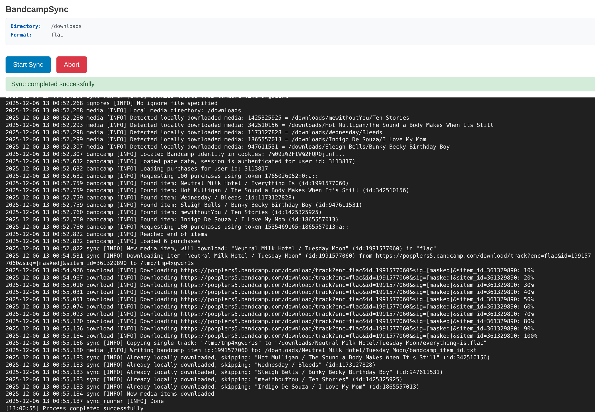

# BandcampSync Web Interface

A simple Flask web interface for running [BandcampSync](https://github.com/meeb/bandcampsync/) with real-time log streaming. Designed to run well alongside [beets-flask](https://github.com/pSpitzner/beets-flask)



## Setup

1. Install dependencies:
   ```bash
   pip install -r requirements.txt
   ```

1. Create your configuration file:
   ```bash
   cp config.example.json config.json
   # Edit config.json with your settings
   ```

1. Run the web interface with your config:
   ```bash
   python app.py config.json
   ```

1. Open http://127.0.0.1:5000 in your browser

## Docker

See [docker-compose.yml](./docker-compose.yml)

## Configuration

Create a `config.json` file with your BandcampSync settings:

```json
{
  "cookies": "your_bandcamp_session_cookies_string_here",
  "directory": "~/Music/Bandcamp",
  "format": "flac",
  "ignore_file": "~/ignores.txt",
  "ignore_patterns": "artist1 artist2",
  "temp_dir": "/tmp/bandcampsync",
  "notify_url": "http://example.com/webhook"
}
```

**Required fields:**
- `cookies`: Your Bandcamp session cookies string (not a file path)
- `directory`: Path to your music directory

**Optional fields:**
- `format`: Audio format (default: "flac")
- `ignore_file`: Path to file with ignore patterns
- `ignore_patterns`: Space-separated list of artists to ignore
- `temp_dir`: Temporary download directory
- `notify_url`: URL to notify when sync completes

## Wait, _another_ service to run?

It idles around 24M of RAM usage.  That's about all you can ask for with Python/Flask.

## Limitations

- Only one sync job can run at a time
- Jobs run in separate processes for isolation
- Logs are kept in memory (last 1000 lines)
- The interface is designed for personal use, not multi-user scenarios. It relies on having a single worker thread because of the use of global variables.
- Configuration is loaded once at startup - restart the app to pick up config changes
